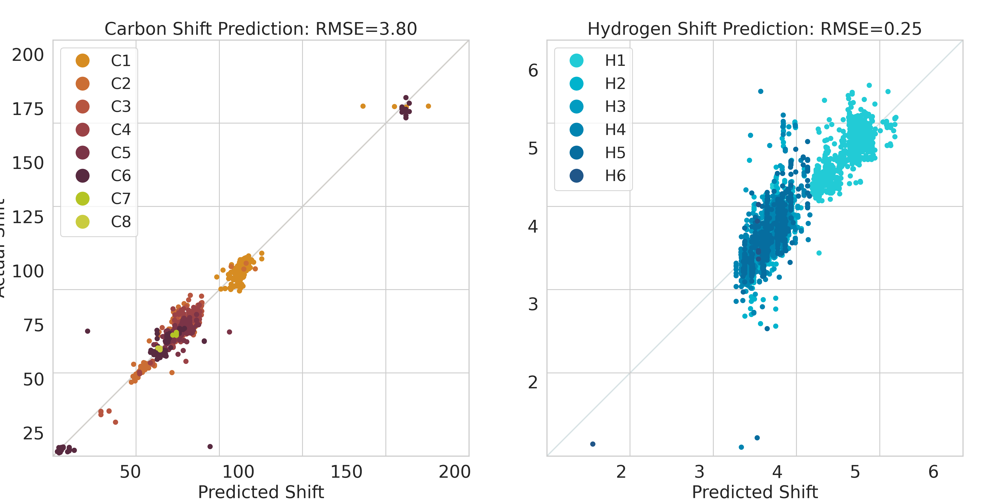

## Data cleaning and preprocessing directory for CASPER and Glycoscience.DB

### Data preprocessing doc for Glycoscience.

+ Comments from domain experts in first inspection [comments](https://github.com/Cyrus9721/GlycoscienceDB_preprocess/blob/main/preprocess_manual/linear_check_comments.txt) as an example.

+ Manual annotation from domain experts in second inspection [annotation1](https://github.com/Cyrus9721/GlycoscienceDB_preprocess/blob/main/preprocess_manual/nonlinear_process_doc.pdf), [annotation2](https://github.com/Cyrus9721/GlycoscienceDB_preprocess/blob/main/preprocess_manual/nonlinear_preprocess_doc_additional_second_round.pdf).

The data cleaning and preprocessing pipeline can be divided into several parts:

1, Reformulate all the .pdb file and label file into interpretable formatting. 

2, A general data cleaning applied to both linear glycans and branched glycans, unifying and correcting the atom-level and monosaccharide format from various labs to be consistent.

3, For linear and nonlinear glycans, a major problem in the Glycosciences experimental data results from mismatches or ambiguities between monosaccharide IDs from .pdb file and label file. Some labels even refer to non-monosaccharide components (e.g. modifications, amino acids) but would naively be loaded as monosaccharide components. The most common occurence was Ac - Acetyl groups, which are frequently given their own NMR shift and/or PDB coordinate rows as a monosaccharide, despite not being a monosaccharide, other times they are inconsistently merged in the same row with the parent monosaccharide. We solve this issue by manual inspection to generate lookup tables for making monosaccharide labels consistent and recategorizing non-monosaccharide components.

4, Additionally for non-linear glycans, a major problem results from the inconsistent sequence ordering between monosaccharide IDs from .pdb file and label file as, unlike linear glycans, there is not one unique ordering across branches. We solve this ordering problem by manually inspecting all the non-linear glycans and using meta-data in the PDB files. 

5, We repeatedly apply an outlier check between the groud truth NMR shift and the predicted NMR shift on the baseline GNN model to catch the remaining most currently severe mismatches or technical issues in the dataset, to see whether the outlier results from further straightforward issues related to step 2, 3, 4. If yes (the usual outcome for an outlier as we designed the preprocessing procedure), we then go back to previous steps and expand the lookup table for converting and categorizing components. 

### Example run on CASPER data.  

CASPER pilot data was overly narrow and simulated a different way than GODESS, it was not included in the GlycoNMR manuscript.

Preprocess the PDB files and their labels(in order): <br />
```
python reformulate_PDB_labels.py
python align_PDB_labels.py
python create_adjaency_matrix_from_labeled_pdb.py
```
Generate node embeddings: 
```
python node_embeddings.py
```
Train the gcn model for combined prediction of Carbon and Hydrogen: 
```
python train_evaluate.py
```
<br />
Predicting atom shift in glycans from CASPER nmr data <br />
The model is trainined on 391 glycans and tested on 40 glycans. <br />
Current RMSE for Carbon: 1.61<br />
Current RMSE for Carbon without node embedding: 1.84<br />
Current RMSE for Hydrogen: 0.10<br />
Current RMSE for Hydrogen without node embedding: 0.19<br />

 <br />


